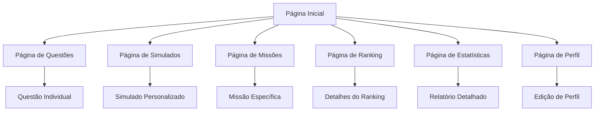

# Documento de Requisitos - Revalida Quest App Vitalício

## 1. Visão Geral do Produto

Transformar o Revalida Quest de um modelo de assinatura para um aplicativo vitalício com acesso ilimitado a todas as funcionalidades. O objetivo é remover completamente todas as barreiras de pagamento e limitações de uso, proporcionando uma experiência educacional completa e gratuita para estudantes de medicina que se preparam para o exame Revalida.

## 2. Funcionalidades Principais

### 2.1 Papéis de Usuário

| Papel          | Método de Registro | Permissões Principais                                  |
| -------------- | ------------------ | ------------------------------------------------------ |
| Usuário Padrão | Registro por email | Acesso completo e ilimitado a todas as funcionalidades |

### 2.2 Módulos de Funcionalidade

Nossos requisitos consistem nas seguintes páginas principais:

1. **Página Inicial**: dashboard principal, navegação, estatísticas de progresso, acesso direto a todas as funcionalidades.
2. **Página de Questões**: banco de questões ilimitado, filtros avançados, histórico completo de respostas.
3. **Página de Simulados**: simulados personalizados ilimitados, análise de desempenho, relatórios detalhados.
4. **Página de Missões**: sistema de gamificação completo, missões ilimitadas, recompensas e conquistas.
5. **Página de Ranking**: classificação global, estatísticas comparativas, badges e conquistas.
6. **Página de Estatísticas**: análises detalhadas de desempenho, gráficos de progresso, relatórios personalizados.
7. **Página de Perfil**: gerenciamento de conta, configurações, histórico de atividades.

### 2.3 Detalhes das Páginas

| Nome da Página         | Nome do Módulo          | Descrição da Funcionalidade                                                                       |
| ---------------------- | ----------------------- | ------------------------------------------------------------------------------------------------- |
| Página Inicial         | Dashboard Principal     | Exibir visão geral do progresso, acesso rápido a todas as funcionalidades, estatísticas resumidas |
| Página Inicial         | Sistema de Navegação    | Navegação intuitiva entre todas as seções sem restrições                                          |
| Página de Questões     | Banco de Questões       | Acesso ilimitado a todas as questões disponíveis, sem limite diário                               |
| Página de Questões     | Sistema de Filtros      | Filtrar questões por área, dificuldade, ano, tipo sem restrições                                  |
| Página de Questões     | Histórico de Respostas  | Visualizar todas as respostas anteriores com análises detalhadas                                  |
| Página de Simulados    | Criação de Simulados    | Criar simulados personalizados ilimitados com qualquer configuração                               |
| Página de Simulados    | Análise de Desempenho   | Relatórios completos de desempenho sem limitações                                                 |
| Página de Simulados    | Histórico Completo      | Acesso a todos os simulados realizados com estatísticas detalhadas                                |
| Página de Missões      | Sistema de Gamificação  | Participar de todas as missões disponíveis sem restrições                                         |
| Página de Missões      | Recompensas e XP        | Ganhar XP e recompensas ilimitadas por atividades                                                 |
| Página de Ranking      | Classificação Global    | Visualizar posição no ranking geral sem restrições                                                |
| Página de Ranking      | Badges e Conquistas     | Desbloquear e exibir todas as conquistas disponíveis                                              |
| Página de Estatísticas | Análises Avançadas      | Gerar relatórios detalhados de desempenho sem limitações                                          |
| Página de Estatísticas | Gráficos de Progresso   | Visualizar progresso ao longo do tempo com dados completos                                        |
| Página de Perfil       | Gerenciamento de Conta  | Editar informações pessoais e configurações                                                       |
| Página de Perfil       | Histórico de Atividades | Visualizar todo o histórico de uso da plataforma                                                  |

## 3. Processo Principal

**Fluxo do Usuário Padrão:**
O usuário acessa a plataforma, faz login ou se registra gratuitamente, e tem acesso imediato e completo a todas as funcionalidades. Pode navegar livremente entre questões, simulados, missões e estatísticas sem encontrar qualquer barreira ou limitação. O sistema de gamificação funciona completamente, permitindo ganho ilimitado de XP, badges e participação em rankings.

## 4. Design da Interface do Usuário

### 4.1 Estilo de Design

* **Cores Primárias**: Azul (#3B82F6) e Verde (#10B981) para transmitir confiança e sucesso

* **Cores Secundárias**: Cinza (#6B7280) e Branco (#FFFFFF) para contraste e legibilidade

* **Estilo de Botões**: Botões arredondados com efeitos de hover suaves

* **Fonte**: Inter ou similar, tamanhos de 14px a 24px dependendo da hierarquia

* **Layout**: Design baseado em cards com navegação superior limpa

* **Ícones**: Lucide React icons para consistência visual

### 4.2 Visão Geral do Design das Páginas

| Nome da Página         | Nome do Módulo          | Elementos da UI                                                                       |
| ---------------------- | ----------------------- | ------------------------------------------------------------------------------------- |
| Página Inicial         | Dashboard Principal     | Cards de estatísticas coloridos, gráficos de progresso, botões de acesso rápido       |
| Página de Questões     | Interface de Questões   | Layout limpo com questão centralizada, opções bem espaçadas, feedback visual imediato |
| Página de Simulados    | Interface de Simulados  | Configuração intuitiva, timer visível, progresso em tempo real                        |
| Página de Missões      | Interface Gamificada    | Cards de missões atrativas, barras de progresso, animações de recompensa              |
| Página de Ranking      | Tabela de Classificação | Design de pódio, avatares de usuários, badges visíveis                                |
| Página de Estatísticas | Dashboards Analíticos   | Gráficos interativos, filtros avançados, exportação de dados                          |
| Página de Perfil       | Interface de Usuário    | Formulários limpos, upload de avatar, configurações organizadas                       |

### 4.3 Responsividade

O produto é mobile-first com adaptação completa para desktop. Inclui otimizações para interação touch em dispositivos móveis, navegação por gestos e layouts adaptativos que mantêm a funcionalidade completa em todas as telas.

## 5. Modificações Técnicas Necessárias

### 5.1 Remoção do Sistema de Assinatura

* Remover completamente o hook `useSubscription`

* Eliminar verificações de `canUseFeature`

* Remover componentes de paywall e limitações

* Desabilitar integrações de pagamento

### 5.2 Remoção de Limitações de Uso

* Eliminar contadores de uso diário/mensal

* Remover tabela `usage_limits` do banco de dados

* Desabilitar modais de limite atingido

* Permitir acesso irrestrito a todas as funcionalidades

### 5.3 Simplificação da Interface

* Remover badges de assinatura

* Eliminar botões de upgrade

* Simplificar navegação removendo seções premium

* Manter apenas funcionalidades essenciais de gamificação

### 5.4 Otimização de Performance

* Remover verificações desnecessárias de permissões

* Simplificar queries de banco de dados

* Otimizar carregamento de componentes

*  

