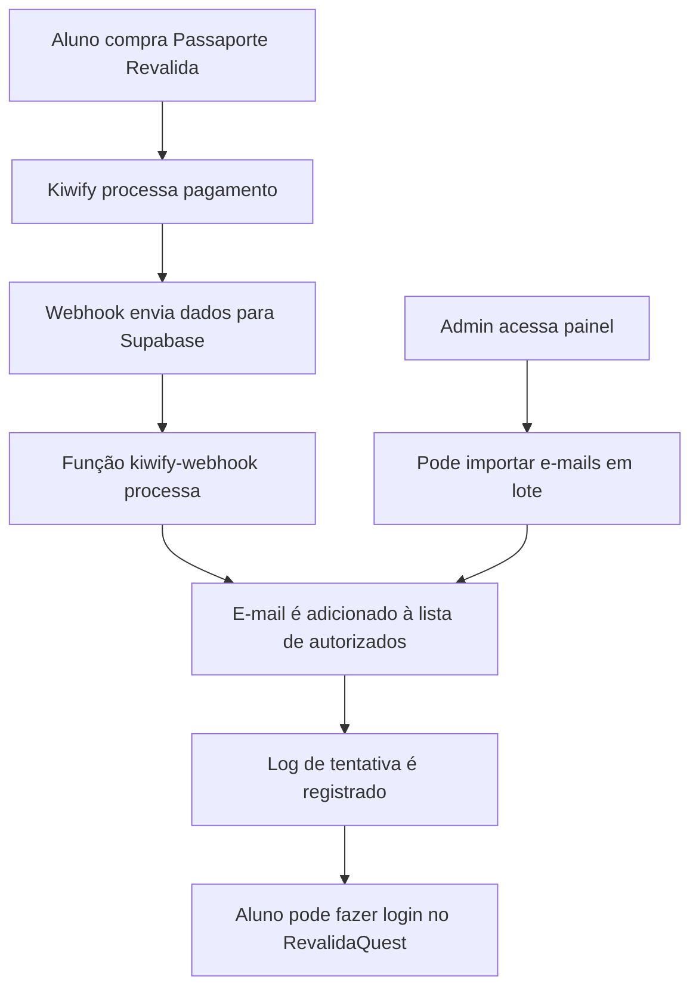

# 🔗 Integração Kiwify + RevalidaQuest

## 📋 Visão Geral

Esta integração automatiza o processo de autorização de e-mails para alunos que compram o curso "Passaporte Revalida" na plataforma Kiwify. Quando um aluno faz a compra, seu e-mail é automaticamente autorizado para acessar o RevalidaQuest.

## 🏗️ Arquitetura da Integração



## 🚀 Implementação

### 1. Função Webhook da Kiwify

**Arquivo:** `supabase/functions/kiwify-webhook/index.ts`

**Funcionalidades:**
- Recebe webhooks da Kiwify
- Valida se é uma compra do "Passaporte Revalida"
- Autoriza automaticamente o e-mail do comprador
- Registra logs de tentativas de acesso
- Previne duplicatas

**Eventos suportados:**
- `purchase.completed` - Compra finalizada

### 2. Componente de Importação em Lote

**Arquivo:** `src/components/BulkEmailImport.tsx`

**Funcionalidades:**
- Upload de arquivo .txt com lista de e-mails
- Colagem direta de e-mails (um por linha)
- Validação automática de e-mails
- Remoção de duplicatas
- Relatório detalhado de importação
- Interface amigável com feedback visual

### 3. Painel Administrativo Aprimorado

**Arquivo:** `src/pages/Admin.tsx`

**Novas funcionalidades:**
- Aba "Importação em Lote" integrada
- Estatísticas em tempo real
- Logs detalhados de tentativas de acesso
- Gerenciamento de e-mails e domínios autorizados

## ⚙️ Configuração

### 1. Deploy das Funções

Execute o script de deploy automatizado:

```powershell
# Windows
.\scripts\deploy-kiwify-integration.ps1

# Linux/Mac
chmod +x scripts/deploy-kiwify-integration.sh
./scripts/deploy-kiwify-integration.sh
```

### 2. Configuração na Kiwify

1. **Acesse o painel da Kiwify:**
   ```
   https://app.kiwify.com.br/dashboard
   ```

2. **Configure o Webhook:**
   - Vá em **Configurações > Webhooks**
   - Clique em **"Adicionar Webhook"**
   - **URL:** `https://[SEU_PROJETO].supabase.co/functions/v1/kiwify-webhook`
   - **Evento:** `purchase.completed`
   - **Método:** `POST`
   - **Status:** Ativo

3. **Teste o Webhook:**
   - Faça uma compra de teste do "Passaporte Revalida"
   - Verifique se o e-mail foi autorizado automaticamente
   - Monitore os logs no painel admin

### 3. Configuração do Produto na Kiwify

Certifique-se de que o produto "Passaporte Revalida" tenha:
- Nome que contenha "Passaporte Revalida" (case insensitive)
- Status ativo
- Preço configurado

## 📊 Monitoramento

### 1. Painel Admin

Acesse `http://localhost:3000/admin` para:

- **Estatísticas em tempo real:**
  - Total de e-mails autorizados
  - Total de domínios autorizados
  - Tentativas de acesso autorizadas/negadas

- **Gerenciamento:**
  - Adicionar/remover e-mails individuais
  - Importação em lote
  - Visualizar logs de tentativas

### 2. Logs do Supabase

Monitore os logs das funções:

```bash
# Logs da função kiwify-webhook
supabase functions logs kiwify-webhook

# Logs da função validate-email
supabase functions logs validate-email
```

### 3. Banco de Dados

Tabelas importantes:

```sql
-- E-mails autorizados
SELECT * FROM authorized_emails ORDER BY added_at DESC;

-- Tentativas de acesso
SELECT * FROM access_attempts ORDER BY attempted_at DESC LIMIT 50;

-- Estatísticas
SELECT 
  COUNT(*) as total_emails,
  COUNT(CASE WHEN domain IS NOT NULL THEN 1 END) as total_domains,
  COUNT(CASE WHEN is_active = true THEN 1 END) as active_emails
FROM authorized_emails;
```

## 🧪 Testes

### 1. Teste de Compra

1. Faça uma compra de teste do "Passaporte Revalida"
2. Verifique se o e-mail foi autorizado automaticamente
3. Tente fazer login no RevalidaQuest com o e-mail
4. Verifique os logs no painel admin

### 2. Teste de Importação em Lote

1. Crie um arquivo .txt com e-mails de teste:
   ```
   teste1@email.com
   teste2@email.com
   teste3@email.com
   ```

2. Acesse o painel admin > Importação em Lote
3. Faça upload do arquivo ou cole os e-mails
4. Execute a importação
5. Verifique os resultados

### 3. Teste de E-mail Não Autorizado

1. Tente se cadastrar com um e-mail não autorizado
2. Verifique se o acesso foi negado
3. Verifique se a tentativa foi registrada nos logs

## 🔧 Troubleshooting

### Problemas Comuns

#### 1. Webhook não está sendo chamado

**Sintomas:**
- E-mails não são autorizados automaticamente
- Logs da função kiwify-webhook vazios

**Soluções:**
- Verificar se a URL do webhook está correta
- Verificar se o evento está configurado como `purchase.completed`
- Verificar se o produto tem "Passaporte Revalida" no nome
- Testar o webhook manualmente

#### 2. E-mail não é autorizado

**Sintomas:**
- E-mail aparece nos logs mas não é autorizado
- Erro na função `add_authorized_email`

**Soluções:**
- Verificar se a tabela `authorized_emails` existe
- Verificar se as funções SQL estão criadas
- Verificar permissões do service_role

#### 3. Importação em lote falha

**Sintomas:**
- Erros ao importar múltiplos e-mails
- Timeout na importação

**Soluções:**
- Verificar se os e-mails estão no formato correto
- Reduzir o número de e-mails por importação
- Verificar conexão com o banco de dados

### Logs de Debug

Adicione logs temporários para debug:

```typescript
// Na função kiwify-webhook
console.log('[DEBUG] Payload completo:', JSON.stringify(payload, null, 2));
console.log('[DEBUG] E-mail do cliente:', customerEmail);
console.log('[DEBUG] Produto:', payload.product?.name);
```

## 📈 Métricas e Analytics

### KPIs Importantes

1. **Taxa de Conversão:**
   - Compra → Autorização automática
   - Autorização → Primeiro login

2. **Tempo de Processamento:**
   - Tempo entre compra e autorização
   - Tempo entre autorização e primeiro acesso

3. **Qualidade dos Dados:**
   - E-mails inválidos
   - Duplicatas
   - Tentativas de acesso não autorizadas

### Relatórios Sugeridos

```sql
-- Relatório diário de autorizações
SELECT 
  DATE(added_at) as data,
  COUNT(*) as autorizacoes,
  COUNT(CASE WHEN notes LIKE '%Compra automática%' THEN 1 END) as automaticas,
  COUNT(CASE WHEN notes LIKE '%Importação%' THEN 1 END) as manuais
FROM authorized_emails 
WHERE added_at >= NOW() - INTERVAL '30 days'
GROUP BY DATE(added_at)
ORDER BY data DESC;

-- Relatório de tentativas de acesso
SELECT 
  DATE(attempted_at) as data,
  COUNT(*) as tentativas,
  COUNT(CASE WHEN was_authorized = true THEN 1 END) as autorizadas,
  COUNT(CASE WHEN was_authorized = false THEN 1 END) as negadas
FROM access_attempts 
WHERE attempted_at >= NOW() - INTERVAL '30 days'
GROUP BY DATE(attempted_at)
ORDER BY data DESC;
```

## 🔒 Segurança

### Medidas Implementadas

1. **Validação de E-mails:**
   - Verificação de formato
   - Remoção de duplicatas
   - Validação de domínios

2. **Logs de Auditoria:**
   - Todas as tentativas de acesso são registradas
   - IP e User-Agent são capturados
   - Timestamps precisos

3. **Controle de Acesso:**
   - Apenas admins podem gerenciar e-mails
   - Funções protegidas por service_role
   - RLS (Row Level Security) ativo

### Recomendações de Segurança

1. **Monitoramento Contínuo:**
   - Configure alertas para tentativas suspeitas
   - Monitore logs regularmente
   - Revise e-mails autorizados periodicamente

2. **Backup e Recuperação:**
   - Faça backup regular da tabela `authorized_emails`
   - Documente procedimentos de recuperação
   - Teste restauração periodicamente

## 🚀 Próximos Passos

### Melhorias Futuras

1. **Notificações Automáticas:**
   - E-mail de boas-vindas para novos alunos
   - Notificação para admins sobre novas autorizações
   - Alertas de tentativas suspeitas

2. **Integração Avançada:**
   - Sincronização bidirecional com Kiwify
   - Cancelamento automático de autorizações
   - Relatórios integrados

3. **Analytics Avançado:**
   - Dashboard de métricas em tempo real
   - Relatórios automáticos
   - Integração com ferramentas de analytics

### Manutenção

1. **Atualizações Regulares:**
   - Mantenha as dependências atualizadas
   - Revise logs periodicamente
   - Teste a integração mensalmente

2. **Documentação:**
   - Mantenha esta documentação atualizada
   - Documente mudanças no sistema
   - Crie procedimentos operacionais

---

**Última atualização:** Janeiro 2025  
**Versão:** 1.0.0  
**Responsável:** Equipe de Desenvolvimento RevalidaQuest 